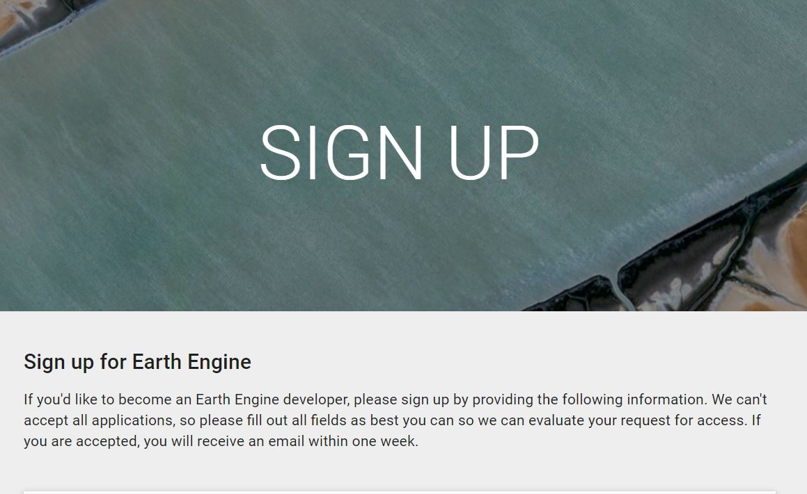

# Registering for a Google Earth Engine Account
If you don’t have a developer account [sign up for one here](https://signup.earthengine.google.com/) and make sure you follow the [instructions](https://developers.google.com/earth-engine/python_install_manual) to install the python CLI.

The API and the CLI gets updated frequently and as does the install process as needed so you can read the [latest instructions at the page.](https://developers.google.com/earth-engine/command_line)
