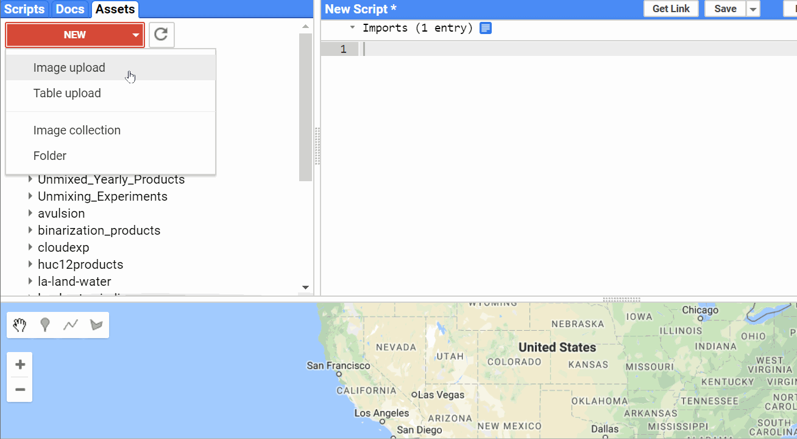
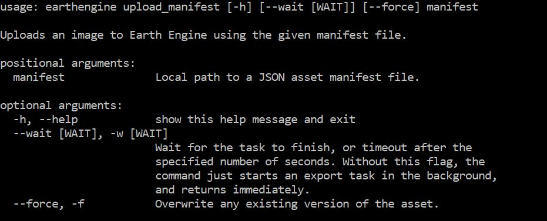
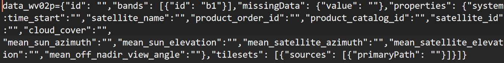

# 
**Motivation and Outline**

The motivation for this project actually came from my working with trying to get Planet labs and Digital Globe datasets in Google Earth Engine while respecting and maintaining large portions of their attached metadata. Though the Earth Engine Code Editor allows users to edit metadata per asset, this would be time consuming for large batch assets and could be achieved programatically post ingestion.With this in mind and while working on this tool, I started to upload datasets with a manifest that Earth Engine could accept.

**Earth Engine Upload Tool**

Around the same time that Google Earth Engine Python Client actually introduced **upload_manifest** and **upload_table_manifest** as two options to upload imagery as well as upload shapefiles or tables. I realized that as I started to ingest and play with other datasets such as **Satellogic Hyperspectral data** or **aerial imagery**, it would be great to build an open source library of manifests that allow for other users to feed in specific fields and ingest data with complete metadata based on their manifest format.

**Earth Engine Upload Manifest tool**

This would also harmonize multiuser same sensor datasets like from drones with the same exact sensors as well as multi user and multi sensor datasets allowing you to submit the manifest type that you could then request as the bare minima of metadata needed for an ingest. Currently you can [find the manifest files here](https://github.com/samapriya/open-manifest/tree/master/manifest%20lib) and I will be adding additional sensors soon. This project is designed to be open source and the manifest format follows recommended and shared manifest examples from Google Earth Engine.

**Example Manifest Single Band WorldView-2 PanChromatic Only**

We are also hoping to create an open source auto-ingestor for people submitting images and metadata files for an end to end delivery. This project is part of an NSF project, and you can check back for more updates when we have something to share. We know in the future this Open Manifest library will be user contributed and will continue to grow as users add more sensor manifests or collaborate with us to build your first. For now, this is exploring only image manifests, but I see the potential of using something like this to standardize manifests for field work that have been tabulated and so on.
